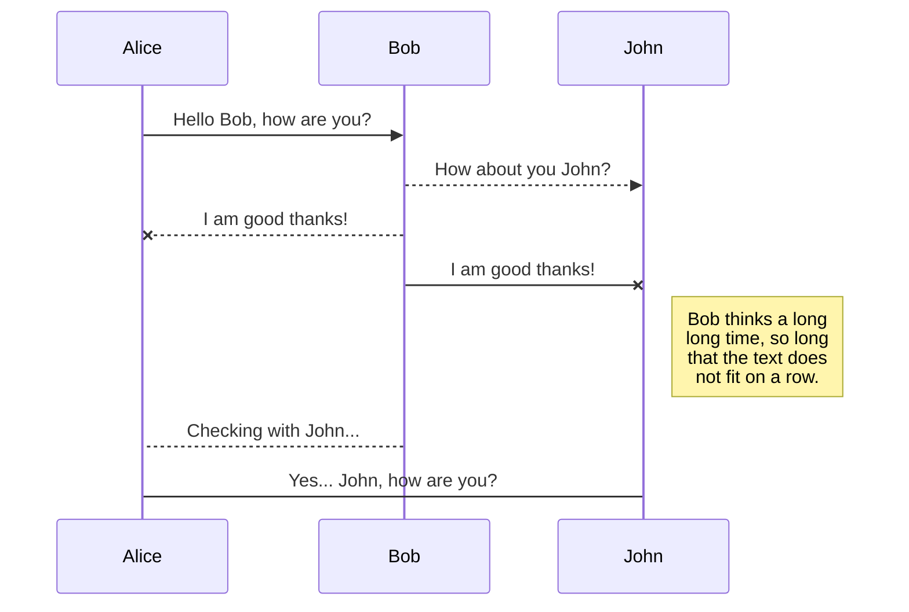
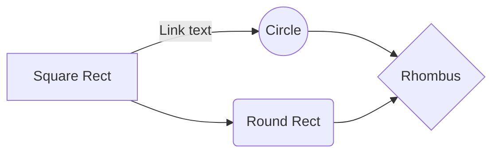

# Vue2

Hi! I'm your first Markdown file in **StackEdit**. If you want to learn about StackEdit, you can read me. If you want to play with Markdown, you can edit me. Once you have finished with me, you can create new files by opening the **file explorer** on the left corner of the navigation bar.


# Observer 类


## 使用场景
observer 的实例化只在 observe 函数中进行，入参为一个对象或者数组 

```js
export function observe (value: any, asRootData: ?boolean): Observer | void {
  if (!isObject(value) || value instanceof VNode) {
    return
  }
  let ob: Observer | void
  if (hasOwn(value, '__ob__') && value.__ob__ instanceof Observer) {
    ob = value.__ob__
  } else if (
    shouldObserve &&
    !isServerRendering() &&
    (Array.isArray(value) || isPlainObject(value)) &&
    Object.isExtensible(value) &&
    !value._isVue
  ) {
    ob = new Observer(value)
  }
  if (asRootData && ob) {
    ob.vmCount++
  }
  return ob
}
```
## Observer
  observer 类会作用到每一个被观察的对象里。observer会将目标obj的属性转换为 getter/setter 的形式，这样就可以进行依赖收集和变更分发。
  

```js
...
/**
 * Observer class that is attached to each observed
 * object. Once attached, the observer converts the target
 * object's property keys into getter/setters that
 * collect dependencies and dispatch updates.
 */
export class Observer {
  // 传入实参数据 value 
  value: any;
  // Dep 对象
  dep: Dep;
  // 把 value 当作根 $data 属性的 vm 实例个数
  vmCount: number;

  constructor (value: any) {
    // 初始化赋值
    this.value = value
    this.dep = new Dep()
    this.vmCount = 0
    // 给 vaule 值定义 __ob__ 属性，值为本对象，这个后续有用到
    def(value, '__ob__', this)
    if (Array.isArray(value)) {
      // --------------------------------------------
      if (hasProto) {                              //
        protoAugment(value, arrayMethods)          //
      } else {                                     // 数组响应式改造
        copyAugment(value, arrayMethods, arrayKeys)//
      } // ------------------------------------------
      // 数组则遍历元素逐个调用 observe 响应式化
      this.observeArray(value)
    } else {
      // 单个数据对象调用 walk 成员方法
      this.walk(value)
    }
  }

  /**
   * Walk through all properties and convert them into
   * getter/setters. This method should only be called when
   * value type is Object.
   */
  walk (obj: Object) {
    const keys = Object.keys(obj)
    // 遍历数据对象所有键，调用 defineReactive 设置为响应式的属性
    for (let i = 0; i < keys.length; i++) {
      defineReactive(obj, keys[i])
    }
  }

  /**
   * Observe a list of Array items.
   */
  observeArray (items: Array<any>) {
    // 遍历数组，每个元素传入 observe 响应式化
    for (let i = 0, l = items.length; i < l; i++) {
      observe(items[i])
    }
  }
}

// helpers

/**
 * Augment a target Object or Array by intercepting
 * the prototype chain using __proto__
 */
function protoAugment (target, src: Object) {
  /* eslint-disable no-proto */
  target.__proto__ = src
  /* eslint-enable no-proto */
}

/**
 * Augment a target Object or Array by defining
 * hidden properties.
 */
/* istanbul ignore next */
function copyAugment (target: Object, src: Object, keys: Array<string>) {
  for (let i = 0, l = keys.length; i < l; i++) {
    const key = keys[i]
    def(target, key, src[key])
  }
}
...

```

**流程解析**
observer 类在 new observer 实例化对象的时候传入了需要响应式处理的数据对象 value，value 是数组或者对象。在构造函数中，对 value 进行了保存，然后将 实例化的 observer 对象赋值给 value.__ob\_\_，这样就把 value 和 observer 对象关联起来了。

然后根据 value 类型进行不同的处理。如果是数组，则遍历数组中元素，对每个元素调用 observe 响应式处理，执行到最后其实还是对元素执行 new Observer 增加 __ob\_\_ 属性。如果是对象，则遍历属性值调用 defineReactive 进行响应式处理。最终的最终都是通过 defineReactive 做响应式处理，实际上就是对 value 的 setter/getter 进行改造。


## DefineReactive


The file explorer is accessible using the button in left corner of the navigation bar. You can create a new file by clicking the **New file** button in the file explorer. You can also create folders by clicking the **New folder** button.

## Switch to another file

All your files and folders are presented as a tree in the file explorer. You can switch from one to another by clicking a file in the tree.

## Rename a file

You can rename the current file by clicking the file name in the navigation bar or by clicking the **Rename** button in the file explorer.

## Delete a file

You can delete the current file by clicking the **Remove** button in the file explorer. The file will be moved into the **Trash** folder and automatically deleted after 7 days of inactivity.

## Export a file

You can export the current file by clicking **Export to disk** in the menu. You can choose to export the file as plain Markdown, as HTML using a Handlebars template or as a PDF.


# Synchronization

Synchronization is one of the biggest features of StackEdit. It enables you to synchronize any file in your workspace with other files stored in your **Google Drive**, your **Dropbox** and your **GitHub** accounts. This allows you to keep writing on other devices, collaborate with people you share the file with, integrate easily into your workflow... The synchronization mechanism takes place every minute in the background, downloading, merging, and uploading file modifications.

There are two types of synchronization and they can complement each other:

- The workspace synchronization will sync all your files, folders and settings automatically. This will allow you to fetch your workspace on any other device.
	> To start syncing your workspace, just sign in with Google in the menu.

- The file synchronization will keep one file of the workspace synced with one or multiple files in **Google Drive**, **Dropbox** or **GitHub**.
	> Before starting to sync files, you must link an account in the **Synchronize** sub-menu.

## Open a file

You can open a file from **Google Drive**, **Dropbox** or **GitHub** by opening the **Synchronize** sub-menu and clicking **Open from**. Once opened in the workspace, any modification in the file will be automatically synced.

## Save a file

You can save any file of the workspace to **Google Drive**, **Dropbox** or **GitHub** by opening the **Synchronize** sub-menu and clicking **Save on**. Even if a file in the workspace is already synced, you can save it to another location. StackEdit can sync one file with multiple locations and accounts.

## Synchronize a file

Once your file is linked to a synchronized location, StackEdit will periodically synchronize it by downloading/uploading any modification. A merge will be performed if necessary and conflicts will be resolved.

If you just have modified your file and you want to force syncing, click the **Synchronize now** button in the navigation bar.

> **Note:** The **Synchronize now** button is disabled if you have no file to synchronize.

## Manage file synchronization

Since one file can be synced with multiple locations, you can list and manage synchronized locations by clicking **File synchronization** in the **Synchronize** sub-menu. This allows you to list and remove synchronized locations that are linked to your file.


# Publication

Publishing in StackEdit makes it simple for you to publish online your files. Once you're happy with a file, you can publish it to different hosting platforms like **Blogger**, **Dropbox**, **Gist**, **GitHub**, **Google Drive**, **WordPress** and **Zendesk**. With [Handlebars templates](http://handlebarsjs.com/), you have full control over what you export.

> Before starting to publish, you must link an account in the **Publish** sub-menu.

## Publish a File

You can publish your file by opening the **Publish** sub-menu and by clicking **Publish to**. For some locations, you can choose between the following formats:

- Markdown: publish the Markdown text on a website that can interpret it (**GitHub** for instance),
- HTML: publish the file converted to HTML via a Handlebars template (on a blog for example).

## Update a publication

After publishing, StackEdit keeps your file linked to that publication which makes it easy for you to re-publish it. Once you have modified your file and you want to update your publication, click on the **Publish now** button in the navigation bar.

> **Note:** The **Publish now** button is disabled if your file has not been published yet.

## Manage file publication

Since one file can be published to multiple locations, you can list and manage publish locations by clicking **File publication** in the **Publish** sub-menu. This allows you to list and remove publication locations that are linked to your file.


# Markdown extensions

StackEdit extends the standard Markdown syntax by adding extra **Markdown extensions**, providing you with some nice features.

> **ProTip:** You can disable any **Markdown extension** in the **File properties** dialog.


## SmartyPants

SmartyPants converts ASCII punctuation characters into "smart" typographic punctuation HTML entities. For example:

|                |ASCII                          |HTML                         |
|----------------|-------------------------------|-----------------------------|
|Single backticks|`'Isn't this fun?'`            |'Isn't this fun?'            |
|Quotes          |`"Isn't this fun?"`            |"Isn't this fun?"            |
|Dashes          |`-- is en-dash, --- is em-dash`|-- is en-dash, --- is em-dash|


## KaTeX

You can render LaTeX mathematical expressions using [KaTeX](https://khan.github.io/KaTeX/):

The *Gamma function* satisfying $\Gamma(n) = (n-1)!\quad\forall n\in\mathbb N$ is via the Euler integral

$$
\Gamma(z) = \int_0^\infty t^{z-1}e^{-t}dt\,.
$$

> You can find more information about **LaTeX** mathematical expressions [here](http://meta.math.stackexchange.com/questions/5020/mathjax-basic-tutorial-and-quick-reference).


## UML diagrams

You can render UML diagrams using [Mermaid](https://mermaidjs.github.io/). For example, this will produce a sequence diagram:



And this will produce a flow chart:


<!--stackedit_data:
eyJoaXN0b3J5IjpbLTEwODIxMDM3MDhdfQ==
-->