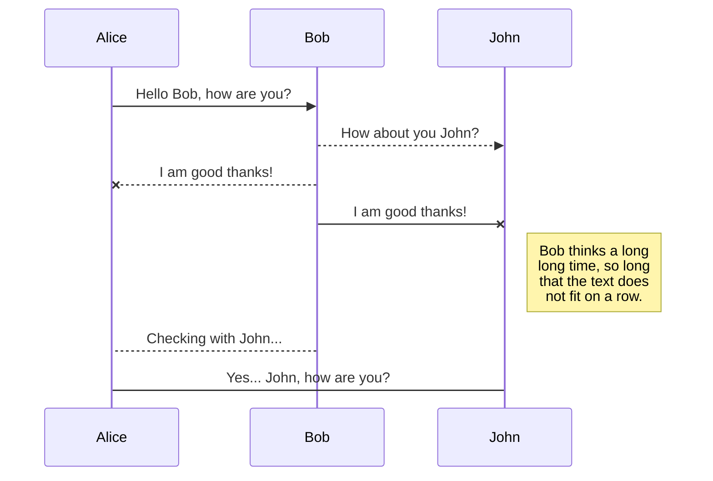
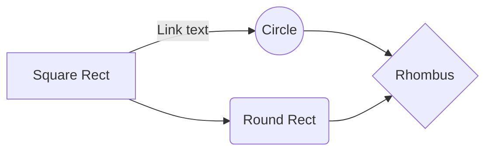

# Vue2

Hi! I'm your first Markdown file in **StackEdit**. If you want to learn about StackEdit, you can read me. If you want to play with Markdown, you can edit me. Once you have finished with me, you can create new files by opening the **file explorer** on the left corner of the navigation bar.


# Observer 类


## 使用场景
observer 的实例化只在 observe 函数中进行，入参为一个对象或者数组 

```js
export function observe (value: any, asRootData: ?boolean): Observer | void {
  if (!isObject(value) || value instanceof VNode) {
    return
  }
  let ob: Observer | void
  if (hasOwn(value, '__ob__') && value.__ob__ instanceof Observer) {
    ob = value.__ob__
  } else if (
    shouldObserve &&
    !isServerRendering() &&
    (Array.isArray(value) || isPlainObject(value)) &&
    Object.isExtensible(value) &&
    !value._isVue
  ) {
    ob = new Observer(value)
  }
  if (asRootData && ob) {
    ob.vmCount++
  }
  return ob
}
```
## Observer
  observer 类会作用到每一个被观察的对象里。observer会将目标obj的属性转换为 getter/setter 的形式，这样就可以进行依赖收集和变更分发。
  

```js
...
/**
 * Observer class that is attached to each observed
 * object. Once attached, the observer converts the target
 * object's property keys into getter/setters that
 * collect dependencies and dispatch updates.
 */
export class Observer {
  // 传入实参数据 value 
  value: any;
  // Dep 对象
  dep: Dep;
  // 把 value 当作根 $data 属性的 vm 实例个数
  vmCount: number;

  constructor (value: any) {
    // 初始化赋值
    this.value = value
    this.dep = new Dep()
    this.vmCount = 0
    // 给 vaule 值定义 __ob__ 属性，值为本对象，这个后续有用到
    def(value, '__ob__', this)
    if (Array.isArray(value)) {
      // --------------------------------------------
      if (hasProto) {                              //
        protoAugment(value, arrayMethods)          //
      } else {                                     // 数组响应式改造
        copyAugment(value, arrayMethods, arrayKeys)//
      } // ------------------------------------------
      // 数组则遍历元素逐个调用 observe 响应式化
      this.observeArray(value)
    } else {
      // 单个数据对象调用 walk 成员方法
      this.walk(value)
    }
  }

  /**
   * Walk through all properties and convert them into
   * getter/setters. This method should only be called when
   * value type is Object.
   */
  walk (obj: Object) {
    const keys = Object.keys(obj)
    // 遍历数据对象所有键，调用 defineReactive 设置为响应式的属性
    for (let i = 0; i < keys.length; i++) {
      defineReactive(obj, keys[i])
    }
  }

  /**
   * Observe a list of Array items.
   */
  observeArray (items: Array<any>) {
    // 遍历数组，每个元素传入 observe 响应式化
    for (let i = 0, l = items.length; i < l; i++) {
      observe(items[i])
    }
  }
}

// helpers

/**
 * Augment a target Object or Array by intercepting
 * the prototype chain using __proto__
 */
function protoAugment (target, src: Object) {
  /* eslint-disable no-proto */
  target.__proto__ = src
  /* eslint-enable no-proto */
}

/**
 * Augment a target Object or Array by defining
 * hidden properties.
 */
/* istanbul ignore next */
function copyAugment (target: Object, src: Object, keys: Array<string>) {
  for (let i = 0, l = keys.length; i < l; i++) {
    const key = keys[i]
    def(target, key, src[key])
  }
}
...

```

**流程解析**
observer 类在 new observer 实例化对象的时候传入了需要响应式处理的数据对象 value，value 是数组或者对象。在构造函数中，对 value 进行了保存，然后将 实例化的 observer 对象赋值给 value.__ob\_\_，这样就把 value 和 observer 对象关联起来了。

然后根据 value 类型进行不同的处理。如果是数组，则遍历数组中元素，对每个元素调用 observe 响应式处理，执行到最后其实还是对元素执行 new Observer 增加 __ob\_\_ 属性。如果是对象，则遍历属性值调用 defineReactive 进行响应式处理。最终的最终都是通过 defineReactive 做响应式处理，实际上就是对 value 的 setter/getter 进行改造。


## DefineReactive


# DEP


Dep 类的实例化只有两个场景应用，一个是在 observer 类的构造函数里，建立 value.__ob\_\_ 的dep，另一个是 defineReactive 里为每一个响应式数据对象添加 dep。

## observer 类中
在构造函数里实例化一个 Dep 对象，并赋值给 observer 实例的 dep。

## defineReactive 函数中
在 object.defineProperty 的外面定义 dep = new Dep()。在 defineProperty 的reactiveGetter\reactiveSetter 中引用 dep。在 get 中使用 dep.depend() 收集依赖，在 set 中使用 dep.notify() 通知更新。
每一个对象的属性都维护了一个 dep，这个 dep 中包含了该属性的依赖信息。

## Dep 类

# Watcher 类


# Markdown extensions

StackEdit extends the standard Markdown syntax by adding extra **Markdown extensions**, providing you with some nice features.

> **ProTip:** You can disable any **Markdown extension** in the **File properties** dialog.


## SmartyPants

SmartyPants converts ASCII punctuation characters into "smart" typographic punctuation HTML entities. For example:

|                |ASCII                          |HTML                         |
|----------------|-------------------------------|-----------------------------|
|Single backticks|`'Isn't this fun?'`            |'Isn't this fun?'            |
|Quotes          |`"Isn't this fun?"`            |"Isn't this fun?"            |
|Dashes          |`-- is en-dash, --- is em-dash`|-- is en-dash, --- is em-dash|


## KaTeX

You can render LaTeX mathematical expressions using [KaTeX](https://khan.github.io/KaTeX/):

The *Gamma function* satisfying $\Gamma(n) = (n-1)!\quad\forall n\in\mathbb N$ is via the Euler integral

$$
\Gamma(z) = \int_0^\infty t^{z-1}e^{-t}dt\,.
$$

> You can find more information about **LaTeX** mathematical expressions [here](http://meta.math.stackexchange.com/questions/5020/mathjax-basic-tutorial-and-quick-reference).


## UML diagrams

You can render UML diagrams using [Mermaid](https://mermaidjs.github.io/). For example, this will produce a sequence diagram:



And this will produce a flow chart:


<!--stackedit_data:
eyJoaXN0b3J5IjpbLTQyNDE5NjExNF19
-->